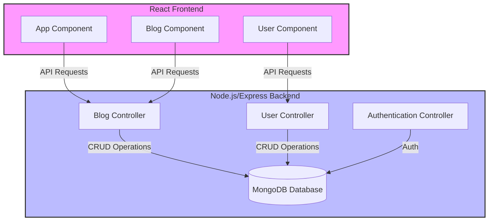

# Full Stack Open Coursework

This repository houses my coursework for the [Full Stack Open course](https://fullstackopen.com/en/), where I acquired foundational skills in modern JavaScript-based web development, particularly focusing on building single-page applications with React, supported by RESTful web services implemented with Node.js.

[Certification](https://studies.cs.helsinki.fi/stats/api/certificate/fullstackopen/en/b254f25ace02a9aff71690cfa09c16ab)

## Technologies and Libraries Explored
- React for UI development
- Redux for state management, utilizing reducers
- REST APIs for server communication
- React Query for server state management
- React Router for routing and navigation
- Express.js and Node.js for server-side programming
- Testing with Jest and other testing libraries
- User authentication and authorization
- React Bootstrap and Material UI for styling
- ESLint for code linting
- Fly.io for deployment to the internet
  
## Course Content Covered
- Fundamentals of Web apps
- Introduction to React
- Communicating with server
- Programming a server with NodeJS and Express
- Testing Express servers, user administration
- Testing React apps
- Advanced state management

## Cornerstone Project: BlogApp (Part 7)
Part 7 of the course culminates in a comprehensive project called BlogApp, which serves as a cornerstone of my learning journey. The BlogApp integrates the full spectrum of skills and technologies learned throughout the course. It's a full-stack web application featuring a React frontend and an Express/Node.js backend, with a focus on building robust single-page applications (SPA).

### BlogApp Overview
- **Frontend**: Developed with React, offering dynamic user interfaces for blog management.
- **Backend**: Implemented using Node.js and Express, responsible for API endpoints, data handling, and server logic.
- **Database**: MongoDB for data persistence, handling blog and user data.
- **Testing**:
  - **Jest**: Used for backend testing, focusing on testing Express server functionality and MongoDB operations.
  - **Cypress**: Employed for end-to-end testing of the frontend, ensuring the UI works as expected from a user's perspective.
- **Key Features**:
  - CRUD operations for blog posts.
  - User authentication and authorization.
  - Responsive and interactive UI components.
  - Integration of frontend and backend for seamless full-stack functionality.

### BlogApp Architecture

