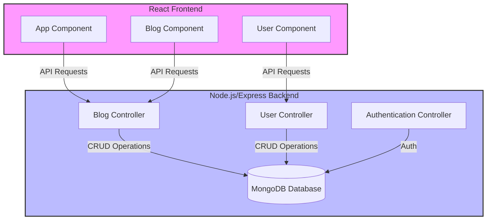

# Single Page Application: BlogApp

## Overview
This project, BlogApp, is a blogging platform with a separate frontend and backend. The frontend is developed using React, while the backend is built with Node.js and Express. This README provides instructions for building and running both parts of the application independently.

## App Architecture



## Runing the App

### Setting Up and Running the Backend
1. Navigate to the `backend` directory:
```
cd backend
```
2. Install dependencies:
```
npm install
```

3. Start the backend server:
```
npm start
```
- The server will run on `http://localhost:3003` (or a different port if configured).
- Ensure the MongoDB URI and other necessary environment variables are configured (via a customized `.env` in the root of `backend`).

### Setting Up and Running the Frontend
Once the backend is running, one can start the frontend:
1. Open a new terminal and navigate to the `frontend` directory:
```
cd frontend
```

2. Install dependencies:

```
npm install
```

3. Start the frontend application:
```
npm start
```

- This will run the frontend on a development server, typically accessible at `http://localhost:3000`.
- During development, ensure the frontend is configured to communicate with the backend (via a proxy setting in `frontend/src/setupProxy.js` for API calls).

### Building Frontend for Production (Optional)
1. To create an optimized production build of the frontend, run:

```
npm run build
```
- This step compiles the frontend into static files in the `frontend/build` directory.
- This production build is used for deploying the application to a production server.
- Note: This step is optional during development and is primarily needed when preparing the application for a production deployment.

## Additional Notes
- The frontend and backend are designed to be run separately in development, offering flexibility and ease of testing.
- Follow the instructions in the `frontend` and `backend` directories for detailed setup and running procedures.